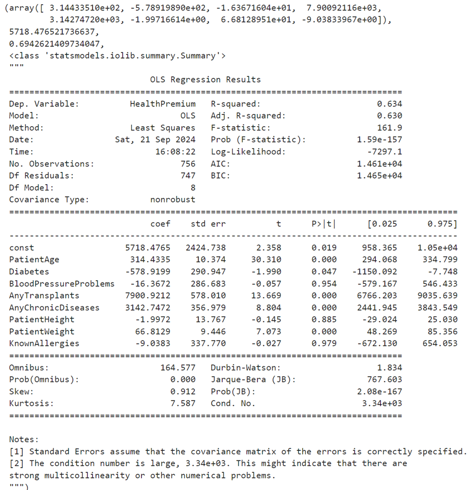

# Multiple Regression Model for Health Premium Prediction

This repository contains a multiple regression analysis developed as part of the DNSC 6303 - Programming for Analytics I course at George Washington University. The project builds and evaluates a predictive model for health insurance premiums based on various health and demographic factors.

## Basic Information
**Names:** N M Emran Hussain  
**Email:** nmemranhussain2023@gmail.com  
**Date:** September 2024  
**Model Version:** 1.0.0  
**License:** [MIT License](LICENSE)

## Intended Use
**Purpose:** 
- Load and preprocess the dataset.
- Build a multiple regression model.
- Analyze model diagnostics.
- Assess the impact of each variable on health premium costs.
- Provide insights and recommendations based on the results.
  
**Intended Users:** 
- Data scientists, machine learning enthusiasts, educators.
  
**Out-of-scope Uses:** 
- The model is not intended for production use in any critical applications or real-time decision-making systems.

## Training Data
**Dataset Name:** payor.csv  
**Number of Rows:** 945  
**Number of Columns:** 9  
**Features Used:** PatientAge, Diabetes, BloodPressureProblems, AnyTransplants, AnyChronicDiseases, PatientHeight, PatientWeight, KnownAllergies and HealthPremium.

### Splitting the Data for logistic regression model
The dataset was divided into training and validation data as follows:
- **Training Data Split:** 80%
- **Validation Data Split:** 20%

### Data Dictionary

| **Feature Name**          | **Description**                                                                              | **Data Type** |
|---------------------------|----------------------------------------------------------------------------------------------|---------------|
| `PatientAge`              | Age of the patient in years.                                                                 | Numeric       |
| `Diabetes`                | Indicator of whether the patient has diabetes (1 for Yes, 0 for No).                         | Binary        |
| `BloodPressureProblems`   | Indicator of whether the patient has blood pressure-related problems (1 for Yes, 0 for No).  | Binary        |
| `AnyTransplants`          | Indicator of whether the patient has had any organ transplants (1 for Yes, 0 for No).        | Binary        |
| `AnyChronicDiseases`      | Indicator of whether the patient has any chronic diseases (1 for Yes, 0 for No).             | Binary        |
| `PatientHeight`           | Height of the patient in centimeters (cm).                                                   | Numeric       |
| `PatientWeight`           | Weight of the patient in kilograms (kg).                                                     | Numeric       |
| `KnownAllergies`          | Indicator of whether the patient has known allergies (1 for Yes, 0 for No).                  | Binary        |
| `HealthPremium`           | Health insurance premium amount for the patient in currency units.                           | Numeric       |

## Model Details
### Architecture  
- This model card utilizes linear model such as **Multiple Regression**. 

### Evaluation Metrics  
- **Coefficient of determination (R²)** - Indicates the strength of relationships
- **P-value** - Indicates statistical significance using 95% confidence level

### Final Values of Metrics for All Data using 'logistic regression' model:
 
 

### Columns Used as Inputs in the Final Model
The following columns were used as inputs (features) in the final model:
- PatientAge  
- Diabetes  
- BloodPressureProblems  
- AnyTransplants  
- AnyChronicDiseases  
- PatientHeight  
- PatientWeight  
- KnownAllergies  

### Column(s) Used as Target(s) in the Final Model
- **Target Column:** HealthPremium  

### Type of Models
- **Multiple Regression Classifier**
  
### Software Used to Implement the Model
- **Software:** Python (with libraries such as Pandas, Scikit-learn, seaborn & matplotlib)

### Version of the Modeling Software: 
- **'scikit-learn'**: '1.4.2',
- **'statsmodels'**: '0.14.2',
- **'matplotlib'**: '3.8.4',
- **'numpy'**: '1.26.4'

### Hyperparameters or Other Settings of the Model
The following hyperparameters were used for the 'logistic regression' model:
- **'fit_intercept'**: True,
- **'normalize'**: False,
- **'n_jobs'**: None,
- **'positive'**: False

## Quantitative Analysis
### Key Findings
- **Significant Variables**: Age, Transplants, Chronic Diseases, and Weight have the most significant impact on health premiums.
- **Insignificant Variables**: Blood Pressure Problems, Height, and Known Allergies showed no significant effect.
- **Model Performance**: The model achieved an R-squared value of 0.694, explaining 69.4% of the variance in premium costs.

## Conclusion
This analysis identifies critical health and demographic factors that impact health premium costs, providing insights for insurance premium modeling. While the model fits reasonably well, some variables remain statistically insignificant, highlighting areas for further refinement and exploration.

